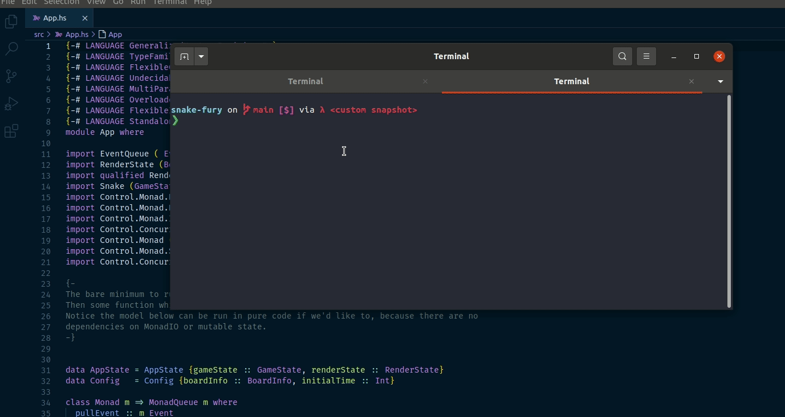
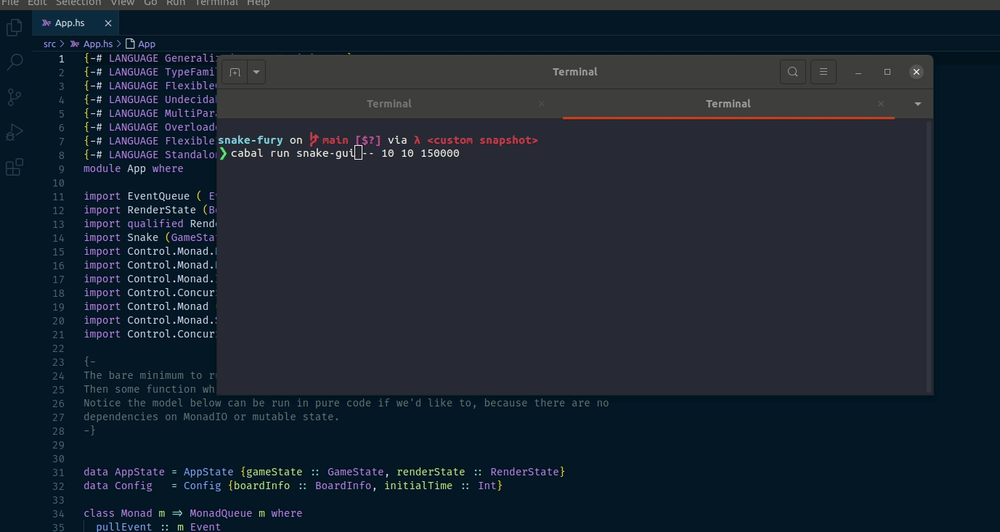

# Haskell's snake challenge.

[](https://gitpod.io/#https://github.com/lsmor/snake-fury)

**This is a work in progress. The last commit is not reliable. If you want to compile, use one of the tags** . 

The idea of this repo is to provide a learning path for Haskell via writing a simple but complex enough program: The Snake Game in the Console. The approach is the following:

The same game is written twice. First, it is written using no monads (read below), all game logic is done with pure functions. Then, the code is refactored to use monads. The idea of this approach is to light away the darkness around monads: The challenger has the opportunity to see with its own eyes how monads lead to cleaner and more ergonomic code.

Exercises ~~are~~ will be tagged with a different version each `v0.1-exercise`, `v0.1-solution`, `v0.2-exercise`, etc... The challenger tries to solve them in their own way and then checks its own solution with the proposed one.

for running the game, checkout the latest aviable tag and compile. Example: `git checkout v1.4.0-improving-performance & stack run -- 40 60 200000` runs the snake game in the console with a 40x60 board and every step in the game happens every fifth of a second. (Notice that stack will download the compiler and libraries, etc... If you have the same version installed in your system, it'll be quick, otherwise go and prepare a coffee)

### note about not using monads
> By that I mean, not using do notation nor functor/applicative/monads combinators like `liftA2`, `fmap`, `>>=`, etc...
> 
> Obviously, The IO and the asynchronous part of the code is provided and the challenger is not expected to solve it.


## Current status
At the moment there are no exercises prepared, but if you are interested there are some tags already prepared to help my future me to design the challenge. run `git tag -l` to see a list of all the tags available

**v0.XX are the versions implemented with only pure functions**
- v0.1 is the minimum viable product. Essentialy a very inefficient version of snake but enough to spit the board to the console. 
- v0.2, v0.3 and v0.4 are little refactoring of v0.1 to make it more efficient (essentially, getting rid of `String` in favour of `Builder`, because you shouldn't use `String` ever!)
- v0.5 is just a side note. Uses Pattern Synonyms to achive better performance.

**v1.XX are the versions using monads**
- v1.1 uses the State monad to refactor the game logic step, leading to clearer version of the same logic (arguably, snake is simple enough to use just pure functions, but you are here to learn monads!). 
- v1.2, v1.3, v1.4 uses the so called [three layer of Haskell pattern](https://www.parsonsmatt.org/2018/03/22/three_layer_haskell_cake.html) to ~~overengineer~~ make the application not dependent on the concrete implementation, but on abstractions. 
- v1.5 is the same as v0.5. If you have reached here, you might be interested in cheking it out!

This is how the game looks in the terminal:


**v2.XX are the versions using monads with SDL**
- whereas versions 0 and 1 render the snake game simply by flushing out a bytestring into the console, the version 2 uses sdl to provide a graphical interface to the game. The key point of this steps is realize how abstractions like `mtl` or `HasXXX` type classes lead to better code reusability.

This is how the game looks as a gui:


## What this repo is *NOT*
This is not a Haskell tutorial. The challenger is expected to know (at least a little) basic Haskell: syntax, recursion, algebraic data types and records. The challenger should take care about finding learning resources for those parts of the code he/she doesn't understand. Of course, it isn't mandatory to know them perfectly, and the challenge is intended to be difficult if you are a beginner... otherwise, I wouldn't be a challenge isn't it?


# Overview.

The general arquitecture of the software is the following:
- we have two threads. 
    - The sencondary thread is continuously reading from users keyboard and pushing the key strokes into an asynchronous queue
    - The main thread reads at steady time from the queue, and based on what the user has pressed, it runs the game logic and prints the board in the console
- We keep in memory two states.
    - the game state has all the info about the game logic
    - the render state has info for rendering. 
- The two states components communicate via messages. Every change in the game state sends a message to the render state.

The following diagram helps to visualize

```
        translate key strokes into snake
        movements. 
            ex: UpArrow -> Move North, 
                LeftArrow -> Move West, 
                etc...

                   +--------- Secondary Thread ---------+           This Thread runs continuously
                   |                    +------------+  |           So if the user pressed keys faster
(user keyboard) ----> writeUserInput -> | EventQueue |  |           Than the game logic updates, We
                   |                    +------------+  |           Still capture the key stroke.
                   +---------------------------|--------+
                                               |--->--|  
             +------------------ Main Thread ---------|--------+    This thread runs at constant time,  
             |                                        |        |    as the snake game does. Pulls event
 (draw to <---------|    |-- RenderMessage <--|    readEvent   |    from the queue and updates GameState
  console)   |      |    |                    |       |        |    
             |     +-------------+          +-----------+      |    Then, the changes in the games state
             |  |->| RenderState |->|    |->| GameState |->|   |    spawn messages for the rendering state
             |  |  +-------------+  |    |  +-----------+  |   |    
             |  |     update on     |    |    update on    |   |    The rendering state updates based on
             |  |   RenderMessage   |    |      Event      |   |    such messages
             |  |----<-------<------|    |----<-------<----|   |
             +-------------------------------------------------+ 

        Notice the the user might not press any key. In such a situation
        The readEvent function should return a Tick event. 

```


## Contributions
The current state is not good for contributions, since I am still defining the overall structure of the challenge.

