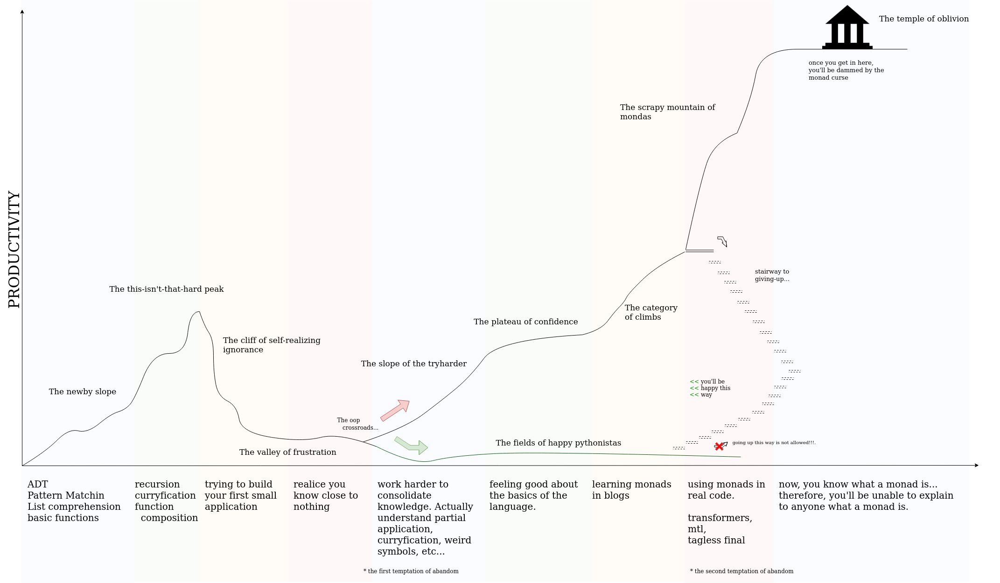
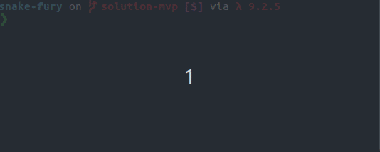
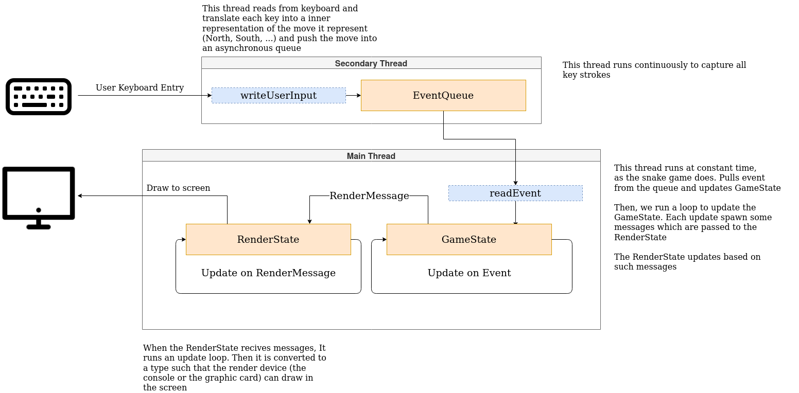

# snake-fury

- [snake-fury](#snake-fury)
  - [Introduction](#introduction)
    - [note about not using monads](#note-about-not-using-monads)
  - [Start coding: Building a MVP](#start-coding-building-a-mvp)
  - [Continue coding: Refactors](#continue-coding-refactors)
  - [Solution branches](#solution-branches)
  - [Architecture](#architecture)
  - [Contributions and Feedback](#contributions-and-feedback)

## Introduction

**Welcome to snake-fury**: the Haskell challenge for beginners. This challenge aims to provide a learning path for people willing to learn Haskell further than basic recursion exercises by implementing the snake game in Haskell. Snake-fury's pedagogical approach is based on two legs:

- snake-fury isn't a tutorial but a challenge.
- snake-fury is focused on learning by refactoring, not by example.

The first leg means that you'll be asked to implement some functions/algorithms. It is expected that the challenger will be unable to implement them without some research on Hackage's documentation, blogs, youtube videos, etc. There will be guidelines to help the challenger. Nevertheless, an important skill when learning Haskell is to be able to search, read and understand the documentation that is (often, but not always) more complex and less accessible than other programming languages.

The second leg is even more interesting. Haskell is notoriously known for its difficulty and the popularization of the holy triad: Functor - Applicative - Monad. There are plenty of tutorials showing examples and hundreds of thousands of lines trying to make them accessible and newcomer-friendly... But with all due respect, It seems they all fail to explain: "Why monads? Why not other less mathematical abstraction? Why not classic OOP patterns?". The approach given by snake-fury is to make the same application twice... it sounds crazy, but the idea goes like this: You'll implement a "pure" version of the snake game: No monads, no functors, no abstractions [[see below](#note-about-not-using-monads)]. Then you will refactor the core application logic using the state and reader monads. Then you'll be asked to abstract your code and to use `mtl` classes to make your code less dependent on the concrete implementation.

Below there is a dramatization of Haskell's learning curve. This challenge aims to be a helpful companion from the newby slope to the temple of oblivion... but be aware, nothing will save you from the temptation of abandon. Hopefully, you'll be able to climb up to the temple and spread the lambdas  



### note about not using monads

> By that I mean, not using do notation nor functor/applicative/monads combinators like `liftA2`, `fmap`, `>>=`, etc...
> Obviously, The IO and the asynchronous part of the code are provided and the challenger is not expected to solve it.

## Start coding: Building a MVP

First you need access to a Haskell development environment. You can either:

- Install it locally following the [official guide](https://www.haskell.org/get-started/) (Recommended).
- You can use gitpod to quickly jump into an [online environment](https://www.gitpod.io/docs/introduction/getting-started). Follow these considerations:
  - You will need a fork of the repo in order to save your progress
  - If you are a `stack` user, modify the `hie.yaml` so the cradle is `stack` not `cabal`

Once you have a dev-env up and running, clone the code and move to `snake-fury-exercise` branch

```bash
git clone https://github.com/lsmor/snake-fury.git
git checkout snake-fury-exercise

# Optionally, you can create a solution branch out of this one
git checkout -b my-solution # (example name)
```

You should see this folder structure (among other files)

```bash
app
 |- Main.hs            # (implemented)     the entrypoint of your application.
src
 |- EventQueue.hs      # (implemented)     here is the EventQueue.
 |- GameState.hs       # (not implemented) here will go the logic of the game.
 |- RenderState.hs     # (not implemented) here will go the data structures for rendering the game
 |- Initialization.hs  # (implemented)     some utility functions
```

Exercises are comments in the files:

- `src/GameState.hs`
- `src/RenderState.hs`

They can be filled in any order.

Each file correspond to each component in the system (and some utilities to keep code simpler). Be sure you read the [architecture](#architecture) section to understand why the code is structured this way. Notice that you'll need to implement as many auxiliary functions as you need to make it work. If you feel stuck you can check the [solution](#solution-branches) I've implemented.

Once you complete all exercises in `GameState.hs` and `RenderState.hs` you should be able to run the snake game in a terminal with the command below.

```bash
# To move the snake, either
#   use arrow keys: ← ↑ → ↓
#   use vim motions: hjkl
#   use gamer motions: wasd

# cabal users
cabal build
cabal run snake-fury -- height width fps # A common set up is a 10x10 board running at 6 fps

# stack users
stack build --stack-yaml stack-ghc-<your.system.version>.yaml
stack run snake-fury -- height width fps # A common set up is a 10x10 board running at 6 fps
```



## Continue coding: Refactors

You've built a minimum viable product. Now it is time to improve it!. In the `exercises` folder you have intructions for refactoring. Follow them one by one as enumerated. One of the ideas is you feel the power of the type system when refactoring. Also you'll be dealing with poor design choices implemented in the mpv part.

- **refactor-1**: you will move from you mvp to a full snake game with all the functionality: like a score counter and increasing speed. Also, you'll deal with performance issue the mvp has.
- **refactor-2**: you will refactor the logic of the game to use the state monad. Hopefully you'll find code much easier to read.
- **refactor-3**: you will refactor the logic of the game to use the reader + state monad stack. Also, as an optional but recommended exercise, you can learn about the IO monad
- **refactor-4**: You will refactor the code to use `mtl` like constraints. Now the code looks a little bit abstract but it is easy to read and follow
- **refactor-5**: Finally, you'll refactor the code to be fully abstracted over the monad stack you use. You will create you own type classes expressing exactly the actions you want to execute.

## Solution branches

You have multiple solutions branches, one for each refactor step and one for the mvp. Below you have the relation of branches and refactors. You can run `git branch -l` to see the list of all branches.

- `solution-mvp` branch corresponds to the solution of the first exercise
- `solution-refactor-1` branch corresponds to the solution of the first refactor in [exercises/refactor-1](exercises/refactor-1.md)
- `solution-refactor-2.1` branch corresponds to the solution of the second refactor, step 1 in [exercises/refactor-2](exercises/refactor-2.md#step-1-apply-changes-locally)
- `solution-refactor-2.2` branch corresponds to the solution of the second refactor, step 2 in [exercises/refactor-2](exercises/refactor-2.md#step-2-did-you-spot-the-pattern-thats-a-monad)
- `solution-refactor-3` branch corresponds to the solution of the third refactor in [exercises/refactor-3](exercises/refactor-3.md)
- `solution-refactor-4.1` branch corresponds to the solution of the fourth refactor, step 1 in [exercises/refactor-4](exercises/refactor-4.md#step-1-mtl-constraints)
- `solution-refactor-4.2` branch corresponds to the solution of the fourth refactor, step 2 in [exercises/refactor-4](exercises/refactor-4.md#step-2-glue-together-renderstate-and-gamestate)
- `solution-refactor-5` branch corresponds to the solution of the fifth refactor in [exercises/refactor-5](exercises/refactor-5.md)

My solution might be different than yours, and that is totally fine. All solution branches should build and run the same as your exercise branch.

> note 1: `main` branch is unstable an you shouldn't build it. Contains all sort of experiments, including an heavy sdl front-end
>
> note 2: At the moment, the `main` branch doesn't use frames per second but microseconds as input parameter. Hence `cabal run snake-fury -- 10 10 100000` will run at 10 fps. In the exercise branch, the input parameter is correct. So if you want to build from `main` be aware of this change.

## Architecture

The general architecture of the software is the following:

- There are three major components:
  - An _Event Queue_: It keeps a queue of the following events to happen in the game based on the user keyboard input
  - A _Game State_: Is the logic state. It keeps track on the snake body, the current apple, the direction of movement, etc...
  - A _Render State_: Is the game board. Instead of building up the board from the GameState, we keep an array in memory and modify it as convenient
- Each compoment sends a message to the next one in the following order: `(user keyboard) -> EventQueue -> GameState -> RenderState -> (render device)`
- We have two threads:
  - The secondary thread is continuously reading from user's keyboard and pushing the key strokes into an asynchronous `EventQueue`
  - The main thread reads at steady time from the `EventQueue`, and based on what the user has pressed, it runs the game logic and prints the board in the console

Notice that two threads are necessary, since user could press keys faster than the game updates (fps). For example let say we run a frame each second and a half (normal speed in the snake game), then a user is likely to press keys faster than that. If the key strokes are catched only when a frame is about to be rendered, then many strokes will be lost.

The following diagram helps to visualize



## Contributions and Feedback

Please, open an issue if you:

- find some solution branch doesn't build. Typically this is due to some external dependencies not available or an error with `cabal`. Add label _solution branch does not build_ to the issue
- If you think the README or any of the exercises is poorly written, or could be improved substantially. Add label _documentation_ to the issue
- If the software builds but it missbehaves. For example, the snake doesn't move, or the board looks wrong. Add label _bug_ to the issue
- If you want to provide some feedback (see below). Add label _feedback_ to the issue.

If you want to contribute with a PR, take into account that due to the refactoring nature of the challenge, there are many branches. This makes integration difficult but you should follow these two rules:

- **Documentation** should be merge into `main` branch. This rule apply to README, any markdown under `exercises`, and any file in the `assets` folder
- **Code** should be merge into `solution-mvp` if the change applies to all refactors; Or merge into `solution-refactor-XXX` if the change applies only to that refactor, hence you should branch out from the corresponding branch. Any change done in `solution-mvp` is merge into `snake-fury-exercise` and `solution-refactor-XXX`.
- If you aren't sure how to contribute, just ask :)

The branch graph look like:

```txt
main
 |-solution-mvp
   |-snake-fury-exercise
   |-solution-refactor-1
     |-solution-refactor-2
       |-solution-refactor-2.2
         |-solution-refactor-3
           |-solution-refactor-4.1
             |-solution-refactor-4.2
               |-solution-refactor-5
```

Also I'd appreciate if you write some feedback for me. As already said, open an issue with a label _feedback_. These issue won't be closed, as it is easier for someone comming to the challenge to filter by open issues with label _feedback_, rather than closed issues. Please, do not use the _feedback_ issue for any other than providing feedback, so if you have an idea on how to improve the challenge open a second issue with your proposal. Ideally _feedback_ issue will have a maximum of two comments: the feedback itself, and a second comment in case the issue is outdated due to changes.  Avoid meaningless feeback if possible.

Positive feedback should answer these questions:

- How much Haskell did you know before starting the challenge?
- Does the project helped you with some concepts more than other resources?
- In your opinion, What's the most difficult part?

Negative feedback (is welcome) should answer these questions:

- How much Haskell did you know before starting the challenge?
- How much of the project have you completed?
- How can I improve the challenge?

Here are some examples:

> **Wrong positive feedback**
>
> This challenge is cool!

---

> **Right positive feedback**
>
> This challenge is cool!. I learnt some Haskell a year ago but could not build anything usefull with it (so I was in the valley of frustration and abandom the language). Monads are much clearer now, I am still wrapping my head around mtl style, but sure I will get it!!.

---

> **Wrong negative feedback**
>
> This challenge is worthless

---

> **Right negative feedback**
>
> This challenge is worthless. I've being learning Haskell for the last 6 months and still I am unable to build anything usefull. Building the mpv is doable (but very difficult), but when you start with the first refactor you end up touching the f**** IO monad and using ByteString/Builder. Why on earth Haskell hasn't a good default string library??.
>
>This challenge should make an effort to explain all the inconviniences newcommers should face when getting into the language.

Thanks for reading
